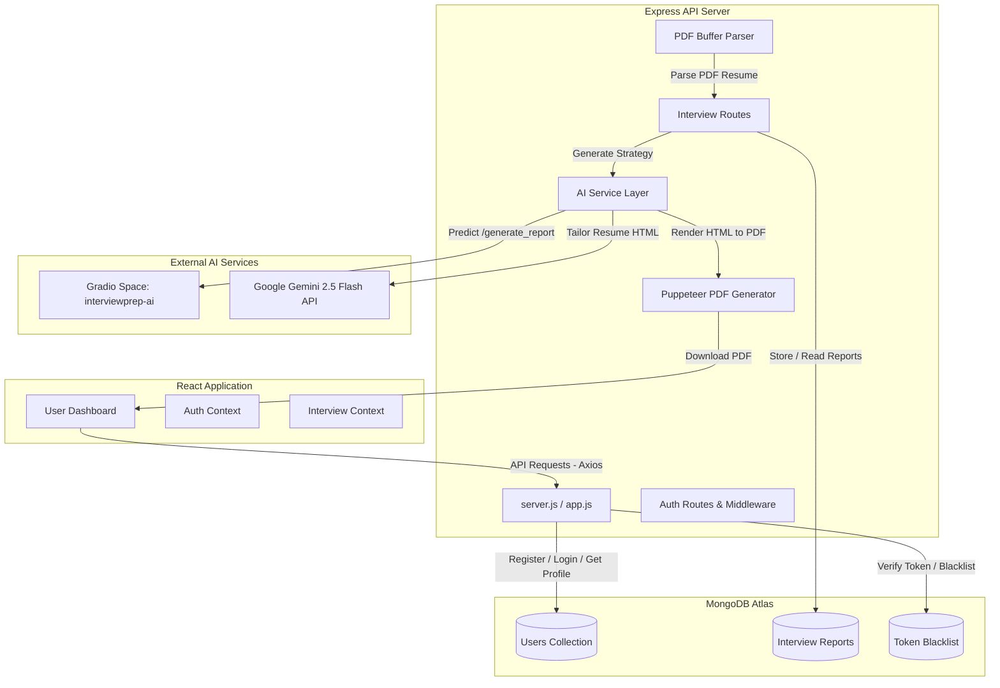

# 🤖 InterviewPrep AI

An advanced, full-stack, AI-powered **Interview Preparation & Resume Customization Platform** that helps candidates evaluate their profiles against target job descriptions, generates tailored behavioral & technical question banks, establishes dynamic preparation roadmaps, and builds ATS-optimized resumes.

---

## 🚀 Project Overview

**InterviewPrep AI** is a comprehensive solution designed to bridge the gap between candidate qualifications and job expectations. By utilizing state-of-the-art Generative AI models (including **Google Gemini 2.5 Flash** and a custom **Gradio AI Space**), the application delivers highly personalized preparation strategies. 

Candidates either upload a PDF resume or write a quick self-description alongside the target job description. The platform instantly analyzes the profile and generates a robust dashboard that includes tailored questions, a roadmap, skill gap analysis, and a customized downloadable PDF resume.

---

## 🌟 Key Features

*   **🔐 Secure User Authentication & Sessions**: Complete registration and login system utilizing encrypted JWTs inside HTTP-only cookies, robust Bcrypt password hashing, and token blacklisting on logout.
*   **📄 PDF Resume Parser**: Extracts in-memory textual data from uploaded resume PDFs securely using `pdf-parse`, eliminating the need for temporary disk storage.
*   **📊 Smart Job Matching Score**: Evaluates the candidate's experience and resume content against the job description to provide a contextual **Match Score (%)**.
*   **💡 Dynamic AI-Generated Question Banks**:
    *   **10 Tailored Technical Questions**: Hand-picked based on the profile gap, containing the interviewer's specific *Intention* and deep *Model Answers*.
    *   **10 Tailored Behavioral Questions**: Customized scenario questions with structured answering tips.
*   **🎯 Skill Gap Diagnosis**: Scans the resume for missing competencies critical to the job and tags them by severity level (`low`, `medium`, `high`).
*   **📅 Personalized 7-Day Road Map**: Generates a day-by-day learning structure with granular focuses and checklist tasks designed to overcome identified gaps.
*   **✨ Tailored Resume Customizer & PDF Renderer**: 
    *   Invokes Gemini 2.5 Flash to automatically rewrite the candidate's profile to align with the target job's ATS keywords.
    *   Outputs an custom aesthetic HTML layout and converts it to a professional A4-sized PDF on-the-fly using **Puppeteer**.

---

## 🛠️ Tech Stack

### Frontend
*   **Core**: React.js (Vite), JavaScript (ES6+), React Router
*   **State Management**: Context API (`AuthProvider` & `InterviewProvider`)
*   **Styling**: SCSS (Sass structural mapping)
*   **HTTP Client**: Axios (configured with credentials and cookie sync)

### Backend
*   **Runtime**: Node.js
*   **Framework**: Express.js
*   **Database**: MongoDB via Mongoose ODM
*   **Authentication & Security**: JSON Web Tokens (JWT), Cookie-Parser, BcryptJS, Cors

### AI & Services Integration
*   **Gradio AI API Client**: Connecting to `sumanta795/interviewprep-ai` Space for fast deep-learning report generation.
*   **Google Gemini API**: Powered by `@google/genai` (`gemini-2.5-flash`) for dynamic, structured ATS-resume creation.
*   **PDF Engine**: Puppeteer (Headless Browser PDF generator) & PDF-Parse (in-memory buffer parsing).

---

## 📐 System Architecture

The following diagram illustrates how the frontend React app, backend Express API, MongoDB database, and AI integrations (Gradio and Gemini) interact:



---

## 📁 Project Directory Structure

```text
InterviewPrep/
├── Backend/
│   ├── src/
│   │   ├── config/             # DB configuration (Mongoose connection)
│   │   ├── controllers/        # Business logic controllers (Auth & Interview)
│   │   ├── middlewares/        # Auth verify token & Multer file uploads
│   │   ├── models/             # Mongoose Models (User, InterviewReport, Blacklist)
│   │   ├── routes/             # Express routes (auth.routes.js, interview.routes.js)
│   │   ├── services/           # AI services (ai.service.js using Gradio, Gemini, Puppeteer)
│   │   └── app.js              # Express app setup with middlewares
│   ├── server.js               # Server entry point (Port 3000)
│   ├── package.json
│   └── .env                    # Secrets and environment variables
│
├── Frontend/
│   ├── public/                 # Static assets
│   ├── src/
│   │   ├── app.routes.jsx      # React router navigation mapping
│   │   ├── features/           # Feature-based folder structure
│   │   │   ├── auth/           # Login, Register, Protected Route, Auth API & Context
│   │   │   └── interview/      # Home dashboard, Report analysis pages, Interview API & Context
│   │   ├── style/              # Global SCSS styles (variables, themes, layouts)
│   │   ├── App.jsx             # Main Application root element with Context providers
│   │   └── main.jsx            # DOM mounting script
│   ├── eslint.config.js
│   ├── vite.config.js
│   └── package.json
└── README.md                   # Project Master Documentation
```

---

## 🗄️ Database Schemas

### 1. User Model (`user.model.js`)
Stores basic authentication credentials.
*   `username` (String, required, unique)
*   `email` (String, required, unique)
*   `password` (String, required, hashed with Bcrypt)

### 2. Interview Report Model (`interviewReport.model.js`)
Stores the complete analysis history and the generated AI content.
*   `user` (ObjectId referencing Users)
*   `jobDescription` (String, required)
*   `resume` (String, extracted resume text)
*   `selfDescription` (String, optional)
*   `matchScore` (Number, 0 to 100)
*   `title` (String, job title generated by AI)
*   `technicalQuestions` (Array of objects: `question`, `intention`, `answer`)
*   `behavioralQuestions` (Array of objects: `question`, `intention`, `answer`)
*   `skillGaps` (Array of objects: `skill`, `severity` (`low` | `medium` | `high`))
*   `preparationPlan` (Array of objects: `day` (Number), `focus` (String), `tasks` (Array of strings))
*   `timestamps` (auto-generated createdAt & updatedAt)

### 3. Blacklist Model (`blacklist.model.js`)
Handles session validation.
*   `token` (String, required)
*   `createdAt` (Date, expires after 24 hours to match JWT duration)

---

## 🔌 API Routes Reference

### Authentication API (`/api/auth`)

| Method | Endpoint | Access | Description |
| :--- | :--- | :--- | :--- |
| **POST** | `/api/auth/register` | Public | Registers a new user, hashes password, assigns JWT cookie. |
| **POST** | `/api/auth/login` | Public | Authenticates user credentials, sets JWT cookie. |
| **GET** | `/api/auth/logout` | Public | Clears the token cookie and blacklists the token in the DB. |
| **GET** | `/api/auth/get-me` | Private | Fetches current logged-in user details. |

### Interview Prep API (`/api/interview`)

| Method | Endpoint | Access | Description |
| :--- | :--- | :--- | :--- |
| **POST** | `/api/interview/` | Private | Generates a new interview preparation report (accepts resume PDF, jobDescription, selfDescription). |
| **GET** | `/api/interview/` | Private | Fetches all interview reports generated by the logged-in user (metadata only). |
| **GET** | `/api/interview/report/:interviewId` | Private | Fetches detailed interview report (questions, skill gaps, roadmap) by ID. |
| **POST** | `/api/interview/resume/pdf/:interviewReportId` | Private | Customizes the resume for that specific report's JD using Gemini and downloads as PDF. |

---

## ⚙️ Setup and Installation

Follow these steps to run both the backend and frontend servers locally.

### Prerequisites
*   Node.js installed (v18+ recommended)
*   MongoDB Instance (Atlas cloud cluster or Local server)
*   Google Gemini API Key (available on Google AI Studio)

---

### Step 1: Set up the Backend
1.  Navigate to the `Backend` directory:
    ```bash
    cd Backend
    ```
2.  Install dependencies:
    ```bash
    npm install
    ```
3.  Create a `.env` file in the `/Backend` directory and define the following variables:
    ```env
    MONGO_URI=mongodb+srv://<username>:<password>@cluster0.xxxx.mongodb.net/InterviewPrep
    JWT_SECRET=your_jwt_secret_key_here
    GEMINI_API_KEY=AIzaSyxxxxxxxxxxxxxxxxxxxxx
    ```
4.  Start the Node server:
    ```bash
    npm run dev
    # or
    node server.js
    ```
    *The server runs by default on port `3000`.*

---

### Step 2: Set up the Frontend
1.  Navigate to the `Frontend` directory:
    ```bash
    cd ../Frontend
    ```
2.  Install dependencies:
    ```bash
    npm install
    ```
3.  Start the Vite developer server:
    ```bash
    npm run dev
    ```
    *The frontend will run by default on [http://localhost:5173](http://localhost:5173).*

---

## 🤖 AI Core Integrations Workflow

### 1. Report Generation via Gradio Client
When a user clicks "Generate My Interview Strategy", the backend receives the parsed resume text, self-description, and target job description. The application initiates a connection to a specialized AI Hugging Face Space:
```javascript
const client = await Client.connect("sumanta795/interviewprep-ai");
const response = await client.predict("/generate_report", {
  resume: resume,
  self_desc: selfDescription,
  job_desc: jobDescription,
});
```
The Space analyzes the profile and returns a structured JSON payload containing the match score, question banks, gap assessments, and 7-day plan, which are cached directly to MongoDB.

### 2. Custom Resume Generation (Gemini 2.5 Flash + Puppeteer)
When downloading the optimized resume, the server fetches the user's report details and prompts Google Gemini:
*   Gemini takes the candidate's details and rewrites them into a clean, modern HTML CV, applying ATS-friendly structural styling and aligning skills to the target job description.
*   Using Puppeteer, the backend launches a headless browser, sets the page's HTML structure, and prints standard A4 margins to produce a clean, downloadable `.pdf` stream.

---

## 🔒 Security Best Practices
*   **Credentials Security**: Storing JSON Web Tokens inside `HttpOnly` and `Secure` cookies to protect against cross-site scripting (XSS) attacks.
*   **Token Revocation**: Implementing a Mongo database blacklist collection to verify that logged-out tokens cannot be reused to access private APIs.
*   **CORS Configuration**: Restricting browser request access strictly to approved origins (`http://localhost:5173`) with allowed credentials sharing.
